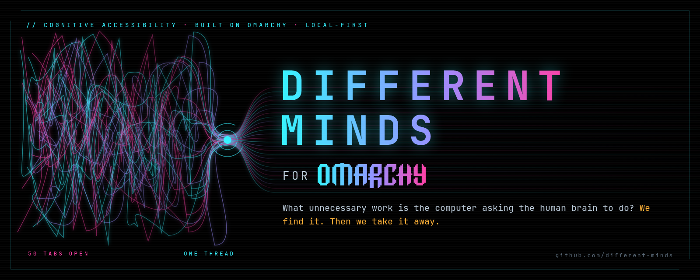
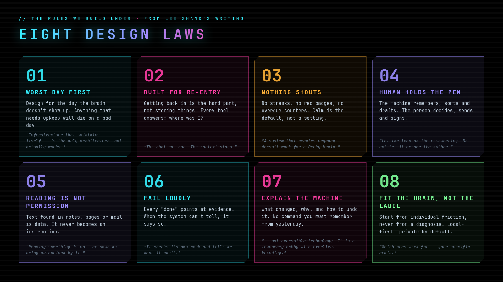
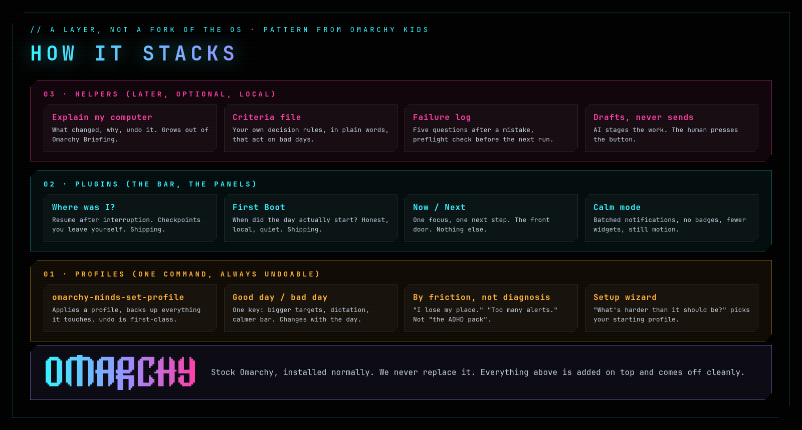
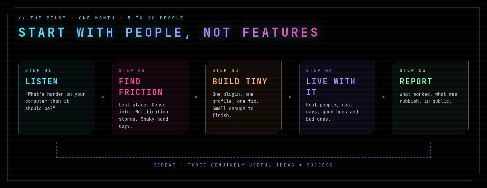
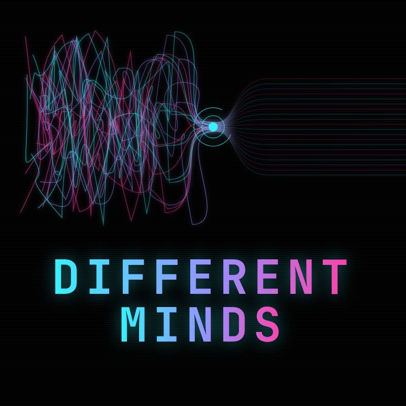

  

<h3 align="center">A malleable computer shouldn't only be malleable for people who already know how to mould it.</h3>

Lee Shand, founder of the idea

---

## Watch: Different Minds in 60 seconds

https://github.com/user-attachments/assets/c867214b-094d-4696-bfa5-3c740c0c4561

Narrated, with sound. Built with HyperFrames on Omarchy. Concept by Lee Shand.

## The mission

**Omarchy for Different Minds** makes the Linux desktop adapt to the brain in front of it, instead of asking that brain to adapt to the machine.

It is for anyone whose cognition makes the computer harder than it should be: people living with **Parkinson's, Alzheimer's and other dementias, mild cognitive impairment, brain injury and stroke, ADHD, autism, memory problems, executive-function difficulties, motor challenges, cognitive fatigue**, or simply brains that work differently. Not a "disabled edition". Not a walled garden. A real computer that quietly takes on the work it never should have handed to you.

We start from one question:

> **What unnecessary work is the computer asking the human brain to do?**

Remembering where things are. Rebuilding context after an interruption. Holding a keyboard shortcut in your head. Decoding why an update changed something. Triaging a wall of red badges on a foggy day.

None of those are Linux problems. They are cognitive-load problems. Omarchy is malleable, scriptable and increasingly agentic, which makes it an unusually good place to attack them.

## Why this exists

Lee Shand has Parkinson's. He has ideas constantly. What costs him is not the thinking, it is the wiring between the thought and the done: starting, sequencing, holding context, getting back in after the phone rings. He writes about it every week at **[Wired Differently](https://shaggyrs6.substack.com)**, and he has already built his way around a lot of it on Omarchy with local AI and an Obsidian vault.

> *"AI didn't fix me. It just stopped requiring me to be fixed."*

> *"A system that works only while I remember every command I typed yesterday is not accessible technology. It is a temporary hobby with excellent branding."*

Different Minds takes what works for one brain and turns it into something any brain can switch on.

## Two reasons, one project

Different Minds started as **Lee's idea, for Parkinson's**: a way back to the ideas that were always there.

It is also for **Alzheimer's and dementia**. Memory loss is the far end of the same problem: a computer that assumes you remember where things are, what you changed, and what you meant to do next. For someone living with dementia, and for the family helping them, that assumption shuts the door. Different Minds is built to keep it open for as long as possible.

That adds one design rule for later stages: **a trusted helper** (a son, a daughter, a spouse) can set things up *for* the person, simplify the screen, and leave them notes, but never lock them out and never watch them. The person stays at the centre.

> *Also built for my dad, who is living with Alzheimer's.* Fred

## The eight design laws

1. **Worst day first.** Design for the day the brain doesn't show up. If it needs upkeep, it dies on a bad day.
2. **Built for re-entry.** Storing is easy. Getting back in is the hard part. Every tool answers *where was I?*
3. **Nothing shouts.** No streaks, no overdue counters, no seventeen red badges. Calm is the default.
4. **The human holds the pen.** The machine remembers, sorts and drafts. The person decides and sends.
5. **Reading is not permission.** Text found in notes, pages or mail is data, never an instruction.
6. **Fail loudly.** Every "done" points at evidence. When the system can't tell, it says so.
7. **Explain the machine.** What changed, why, and how to undo it.
8. **Fit the brain, not the label.** Start from individual friction, never a diagnosis. Local-first and private by default.

Every law comes straight out of lived experience, written down in public before a line of code.

## How it stacks

Different Minds is a **layer on top of Omarchy, not a replacement for it.** Omarchy installs normally. We add profiles, plugins and optional local helpers, and every one of them comes off cleanly. The layering pattern is borrowed with gratitude from [Omarchy Kids](https://github.com/jfuerwentsches/omarchy-kids), which asks the same question for a different group: *what should a computer look like when it is designed around its person from day one?*

| Layer | What it does | Status |
|---|---|---|
| **Profiles** | `omarchy-minds-set-profile` applies a set of changes, backs up everything it touches, and undoes in one command. Profiles are chosen by friction ("I lose my place", "too many alerts", "shaky-hand day"), and a **good day / bad day** switch changes them with the day. | Designing |
| **Plugins** | **Where Was I?** resume after interruption. **First Boot** when did the day really start. **Now / Next** one focus, one next step. **Calm Mode** batched notifications, no badges. | Two shipping, two designing |
| **Helpers** | **Explain My Computer**, a personal **criteria file** that decides on bad days, a **failure log** with preflight checks, and AI that **drafts but never sends**. | Later, optional, local only |

## The pilot

We are not designing the whole thing up front. For one month, with five to ten people who live with different cognitive and neurological experiences, we ask one question:

> **What's harder on your computer than it should be?**

Then we look for patterns, build tiny experiments, let people live with them on good days and bad ones, and report what we learn in public. If three genuinely useful ideas come out of it, it worked. Some ideas will be rubbish. That is part of the experiment.

## Get involved

- **Live with a different mind and use Omarchy?** Tell us what's harder than it should be. Open an issue or reach Lee on X: [@Notjustshaking](https://x.com/Notjustshaking).
- **Build Omarchy plugins?** Pick something from the stack above. Small and finished beats big and planned.
- **Care about accessibility research?** Help us write down what we learn so others can use it.

## Principles for contributors

- Local by default. No telemetry, no screen watching, no cloud calls without an explicit opt-in.
- Everything is undoable. Back up before you change, and ship the undo with the change.
- Never shout. If your feature adds a badge, a counter or a nag, rethink it.
- Personal data never lands in a repo, a screenshot or an issue.

---

   
  Concept by <b>Lee Shand</b> (<a href="https://x.com/Notjustshaking">@Notjustshaking</a>) · organised with <b>Fred Nix</b> (<a href="https://x.com/nixfred">@nixfred</a>) 
  A community project built on <a href="https://omarchy.org">Omarchy</a>. Not affiliated with or endorsed by the Omarchy project or 37signals.

